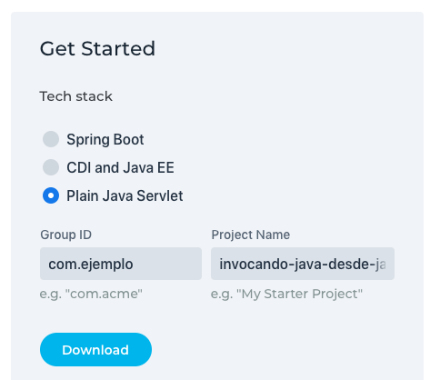
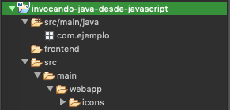
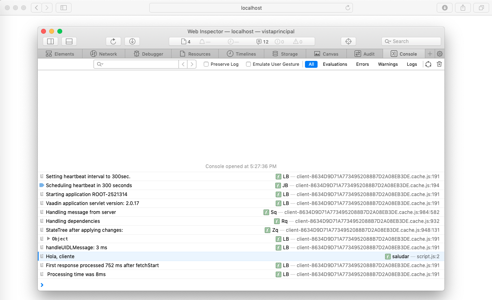
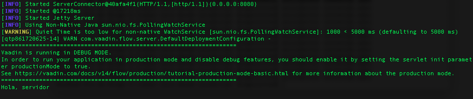
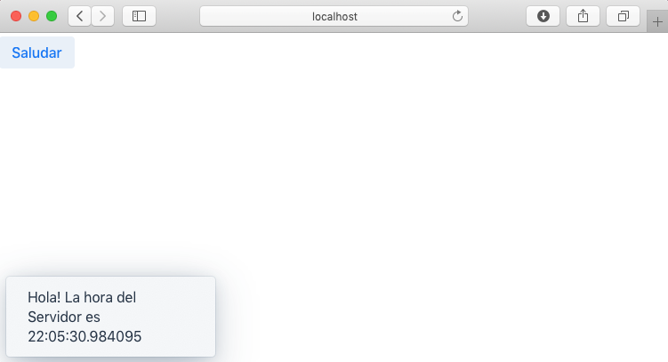

= Invocando Java desde JavaScript

_Traducido del https://vaadin.com/tutorials/calling-java-from-javascript[Original en Inglés]._

Usualmente las aplicaciones Java del lado del servidor pueden habilitar métodos para ser expuestos como un _end-point_ usando Servicios Web REST.  Aunque este es un enfoque completamente correcto, este tutorial muestra una manera alternativa para llamar métodos Java del lado del servidor sin la necesidad de implementar Servicios Web. Esto es posible gracias a Vaadin, un framework que incorpora un conjunto de clases Java que no solo te permiten construir Web UI en Java, sino que también incluye un mecanismo de comunicación automático para realizar el llamado de métodos Java desde JavaScript de manera sencilla.

En este tutorial paso a paso aprenderás a usar Vaadin para llamar código Java del lado del servidor desde código JavaScript del lado del cliente. Lo único que necesitas para seguir el tutorial es entender lo básico del Lenguaje de Programación Java, los fundamentos de JavaScript, tener instalado Java Development Kit (JDK) 8 o posterior y un IDE Java.

NOTE: Puedes encontrar el código fuente del tutorial en https://github.com/vaadin-learning-center/calling-java-from-javascript[GitHub].

== Configurando el proyecto
. Ve a https://vaadin.com/start/latest/project-base[página].
. Verás un formulario para generar una aplicación. En *Tech stack* elige _Plain Java Servlet_,  para *Group ID* escribe _com.ejemplo_ y para *Project Name* escribe _invocando-java-desde-javascript_:

. Da clic en el botón *Download* y debes extraer el contenido del archivo ZIP que fue generado.
. El archivo ZIP contiene un proyecto Maven. Puedes importar el proyecto Maven en tu IDE favorito (Ver instrucciones para https://vaadin.com/tutorials/import-maven-project-intellij-idea[IntelliJ IDEA], https://vaadin.com/tutorials/import-maven-project-eclipse[Eclipse] y https://vaadin.com/tutorials/import-maven-project-netbeans[NetBeans]). El proyecto es un punto de inicio rápido para desarrollar una aplicación web Java con Vaadin.

NOTE: No te inquietes si no conoces Maven. La mayoría de IDEs tienen un soporte excelente para Maven y no necesitas entender todos sus detalles para usarlo. Si quieres aprender más acerca de conceptos claves de Maven puedes ver este https://vaadin.com/tutorials/learning-maven-concepts[artículo].

El _starter_ crea una simple aplicación “Hola, Mundo” que no necesitamos. Queremos mantener el proyecto tan simple como sea posible, por lo tanto, elimina la clase `MainView` y los directorios `resources`, `frontend/src` y `frontend/styles` (No elimines el directorio `frontend`). La estructura del directorio debería lucir así:

Ahora tenemos un punto de inicio limpio sin código de distracción. ¡Comencemos a hackear!

== # Creando una página web vacía
Las aplicaciones web Java son implementadas a través de Servlets. Un Servlet es una clase que mejora la funcionalidad de un servidor web (los cuales usualmente alojan archivos tales como HTML, documentos e imágenes). Este mejoramiento podría incluir cualquier tipo de lógica del lado del servidor, por ejemplo: creación de un documento HTML dinámicamente para incluir contenido proveniente de una base de datos. Cuando tú incluyes Vaadin in tu proyecto, un `VaadinServlet` es automáticamente creado para ti. Este servlet nos permite crear una página web usando Java.

NOTE: Si quieres ver donde esto ocurre, dale un vistazo a la clase https://github.com/vaadin/flow/blob/bb472c66871cd3c2677c36ece91e6263ce020d2d/flow-server/src/main/java/com/vaadin/flow/server/startup/ServletContextListeners.java[ServletContextListeners].

Para ver como crea una nueva clase con el nombre de `VistaPrincipal` en el paquete `com.ejemplo`:

src/main/java/com/ejemplo/VistaPrincipal.java
[source,java]
----
package com.ejemplo;

public class VistaPrincipal {
}

----

Queremos exponer esta clase como una página web, como tenemos a Vaadin in nuestro proyecto y este crea un `VaadinServlet` lo único que necesitamos hacer es agregar una anotación a la clase creada previamente con `@Route` y permitir que la clase extienda un _UI component_ tal como `Div`.

.`*VistaPrincipal.java*`
[source,java]
----
import com.vaadin.flow.component.html.Div;
import com.vaadin.flow.router.Route;

@Route
public class VistaPrincipal extends Div {
}

----

Por defecto, la anotación `@Route` permite a Vaadin mapear la clase con la raíz del contexto cuando la clase anotada se denomina `VistaPrincipal`. Por lo tanto, cuando se lanza la petición a `http://localhost:8080/vistaprincipal`, la clase `VistaPrincipal` ejecutará cualquier lógica definida del lado del servidor.  Si hubiésemos querido mapear la clase hacia `http://localhost:8080/example`, necesitaríamos decirlo explícitamente con `@Route(“example”)`.

Si ejecutas el proyecto en este punto, obtendrás una página web vacía. Confirmémoslo ejecutando el Plugin Maven de Jetty. Si tienes Maven instalado en tu máquina, solo ejecuta la instrucción `mvn jetty:run` en una terminal de línea de comando. Si estas usando un IDE, crear una configuración para el _goal_ `jetty:run`. Ver instrucciones en detalle para https://vaadin.com/tutorials/import-maven-project-intellij-idea[IntelliJ IDEA], https://vaadin.com/tutorials/import-maven-project-eclipse[Eclipse] y https://vaadin.com/tutorials/import-maven-project-netbeans[NetBeans].

NOTE: El Plugin Maven de Jetty está configurado en el archivo `pom.xml`. Este plugin nos permite fácilmente desplegar la aplicación web a un Servidor Jetty sin la necesidad de instalarlo manualmente.

Apunta tu navegador web hacia `http://localhost:8080/vistaprincipal` para ver la página web vacía. Nada emocionante por el momento, pero tienes en ejecución una aplicación web Java.

== # Llamando JavaScript.
Antes de llamar JavaScript desde Java, necesitamos configurar el archivo JavaScript en sí. Crear un nuevo archivo con el nombre `script.js` en el directorio `frontend` y escribe una función en él:

frontend/script.js
[source,javascript]
----
window.saludar = function saludar(nombre) {
    console.log("Hola, " + nombre);
}

----

Necesitamos importar este archivo en la clase Java. Anotar la clase `VistaPrincipal` con `@JavaScript`:

.`*VistaPrincipal.java*`
[source,java]
----
@JavaScript("frontend://script.js")
@Route
public class VistaPrincipal extends Div {
    public VistaPrincipal() {
    }
}

----

NOTE: `frontend://` es usado para referenciar el directorio de los recursos estáticos. Por ejemplo, es útil al transpilar código JavaScript para soportar navegadores web antiguos.

Con el archivo JavaScript cargado, podemos llamar la función `saludar` en el constructor de la siguiente manera:

.`*VistaPrincipal.java*`
[source,java]
----
public VistaPrincipal() {
   getElement().executeJs("saludar('cliente')");
}

----

El metodo `getElement()` retorna una representación Java del elemento `
` en el DOM. Existen pequeñas mejoras que podemos hacer en esta línea de código. Podemos separar los valores de los argumentos desde la invocación de la función y obtener el mismo comportamiento:

.`*VistaPrincipal.java*`
[source,java]
----
public VistaPrincipal() {
    getElement().executeJs("saludar($0)", "cliente");
}

----

Prueba la aplicación ahora. Detener el servidor y reinícialo (usando la configuración de ejecución en tu IDE o escribiendo la instrucción `mvn jetty:run`  usando la línea de comando).

Deberías ver el saludo en la consola del navegador web. 

== # Llamando Java

Ahora que esta funcionando la invocación de JavaScript desde Java, vamos a completar el circulo invocando un método Java desde una función JavaScript. Primero, necesitamos implementar un método Java. Implementemos una versión de saludar en Java de lado del servidor, agregando lo siguiente en la clase `VistaPrincipal`:

.`*VistaPrincipal.java*`
[source,java]
----
public class VistaPrincipal extends Div {
    ...
 
    public void saludar(String nombre) {
        System.out.println("Hola, " + nombre);
    }
}

----

Ahora, necesitamos exponer este método al lado del cliente anotando el método con `@ClientCallable`:

.`*VistaPrincipal.java*`
[source,java]
----
@ClientCallable
public void saludar(String nombre) {
    System.out.println("Hola, " + nombre);
}

----

Para llamar este método desde el lado del cliente, necesitamos retornar la referencia del método Java `getElement()`. Podemos enviarlo hacia la función JavaScript modificando el constructor de la clase `VistaPrincipal`:

.`*VistaPrincipal.java*`
[source,java]
----

public class VistaPrincipal extends Div {
 
    public VistaPrincipal() {
        getElement().executeJs("saludar($0, $1)", "cliente", getElement());
    }
 
    ...
}

----

Puede notar que agregamos el argumento (`$1`) al llamado del a función y ahora añadimos el valor actual como un argumento extra en el llamado hacia el método `executeJs`.

Ahora podemos aceptar este valor al JavaScript del lado del cliente, agregando un parámetro a la función `saludar` de la siguiente manera:

.`*script.js*`
[source,javascript]
----
window.saludar = function saludar(nombre, elemento) {
    console.log("Hola, " + nombre);
}

----

El objecto `elemento` incluye un miembro `$server` que podemos usar para llamar el método `saludar` Java desde el lado del servidor, Aquí esta como se hace:

.`*script.js*`
[source,javascript]
----
window.saludar = function saludar(nombre, elemento) {
    console.log("Hola, " + nombre);
    elemento.$server.saludar("servidor");
}

----

Reinicie el servidor Jetty de nuevo y consulta la aplicación para ver el saludo en el log del servidor:

== ¿Qué sigue?

Y así, el círculo está completo. Hemos llamado JavaScript desde Java y Java desde JavaScript sin usar Servicios Web REST. Si completaste este tutorial, posiblemente ya tienes ideas sobre qué probar a continuación. Podrías querer agregar algo de CSS (puedes hacer algo como `@StyleSheet("frontend://styles.css"))` o posiblemente te gustaría agregar tu propia lógica de negocio en JavaScript y Java.

No obstante, Vaadin es mucho más que una librería para conectar JavaScript con Java. Como te puedes imaginar, el mecanismo de comunicación automatizado de Vaadin puede ser usado para generar potentes interfaces de usuario web. Pues bien, ¡Vaadin te permite hacerlo en Java! Por ejemplo, intenta modificar la clase `VistaPrincipal` de la siguiente forma:

.`*VistaPrincipal.java*`
[source,java]
----
@Route
public class VistaPrincipal extends Div {
 
    public VistaPrincipal() {
        Button boton = new Button("Saludar");
        boton.addClickListener(evento -> {
            LocalTime ahora = LocalTime.now();
            Notification.show("Hola! La hora del Servidor es " + ahora);
        });
        add(boton);
    }
}

----

Sin escribir código en JavaScript en absoluto, obtienes una aplicación web basada en HTML en el navegador.

Si deseas aprender más, consulta el tutorial en: https://vaadin.com/tutorials/getting-started-with-flow.
